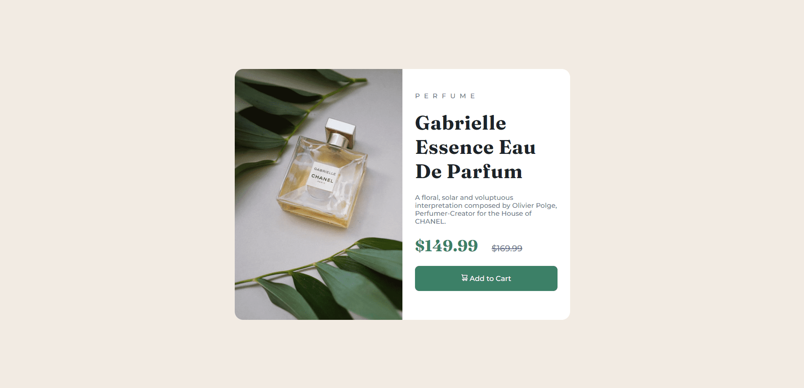

# Frontend Mentor - Product preview card component solution

This is a solution to the [Product preview card component challenge on Frontend Mentor](https://www.frontendmentor.io/challenges/product-preview-card-component-GO7UmttRfa)

## Table of contents

- [Overview](#overview)
  - [The challenge](#the-challenge)
  - [Screenshot](#screenshot)
  - [Links](#links)
- [My process](#my-process)
  - [Built with](#built-with)
  - [What I learned](#what-i-learned)
  - [Continued development](#continued-development)
- [Author](#author)

## Overview

This is a frontendmentor.io challenge project. It's a single product preview card. I have used HTML and CSS for this project. It's a fully responsive design component.
### The challenge

Users should be able to:

- View the optimal layout depending on their device's screen size
- See hover and focus states for interactive elements

### Screenshot

### Links

- Solution URL: (<https://github.com/Mozahidul01/Product-Preview-Card-Component>)
- Live Site URL: (<https://mozahidul01.github.io/Product-Preview-Card-Component/>)

## My process

- First I wrote the HTML code for the design.
- Then I wrote the CSS code according to the design.
- Then I made this layout responsive according to screen size.
### Built with

- Semantic HTML5 markup
- CSS custom properties
- Flexbox
- CSS Grid
- Mobile-first workflow

### What I learned

I have learned use of CSS grid from this challenge. 

## Author

- Website - (<https://www.mozahidul.com>)
- Frontend Mentor - (<https://www.frontendmentor.io/profile/Mozahidul01>)
- Twitter - (<https://twitter.com/Mozahidul01>)
